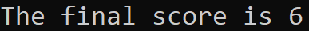

# Prework-CodeChallenges

### Problem 1: Array Max Result

The goal of this problem is to take 5 input numbers between 1 and 10. Then the user will select one of the prior inputs to be "scored". The scoring method is simply that choice multiplied by its frequency. If a user puts in four 4's and a 3 then selects the 4 to be scored, then the final output will be 16, as it is 4 * 4.

#### Example:

