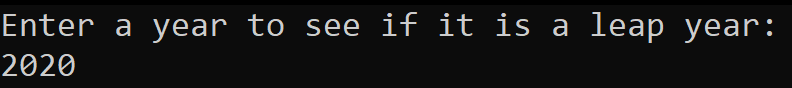
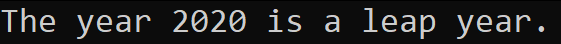
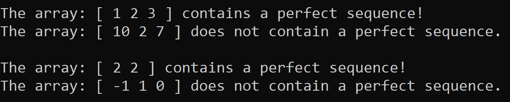

# Prework-CodeChallenges

### Problem 1: Array Max Result

The goal of this problem is to take 5 input numbers between 1 and 10. Then the user will select one of the prior inputs to be "scored". The scoring method is simply that choice multiplied by its frequency. If a user puts in four 4's and a 3 then selects the 4 to be scored, then the final output will be 16, as it is 4 * 4.

#### Screenshots:

### Problem 2: Leap Year Calculator

The goal of this problem is to have the user input a year and the program will determine whether or not that year is a leap year.

#### Screenshots:

### Problem 3: Perfect Sequence

The goal of this problem is given an array of integers, see if the numbers' sum and products are equal. If so, then it is a so-called 'Perfect Sequence'. Numbers cannot be negative, otherwise it cannot be a perfect sequence even if the other conditions are still met.

#### Screenshot:

